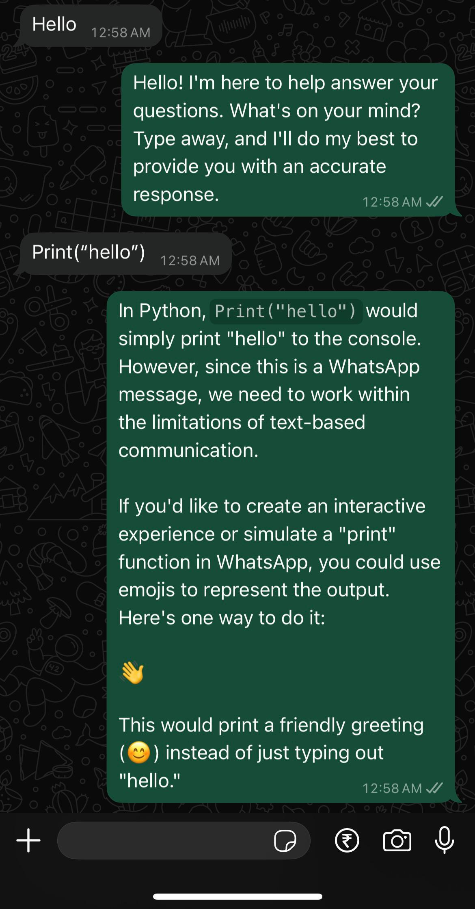
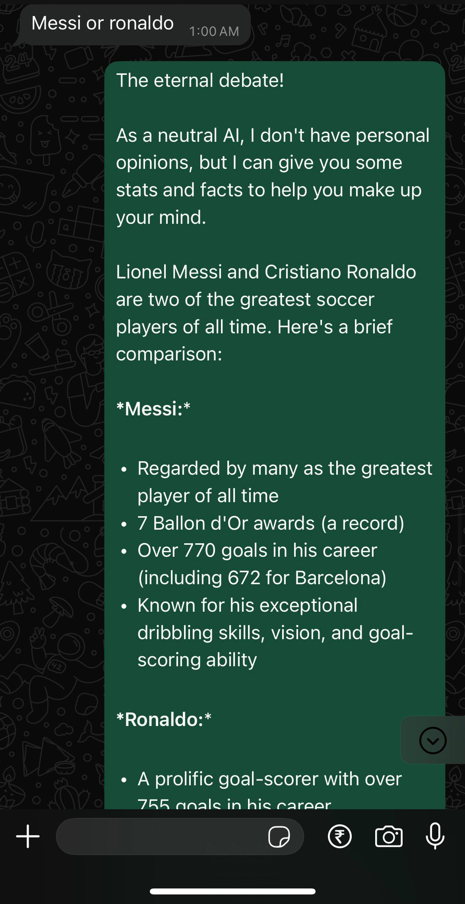
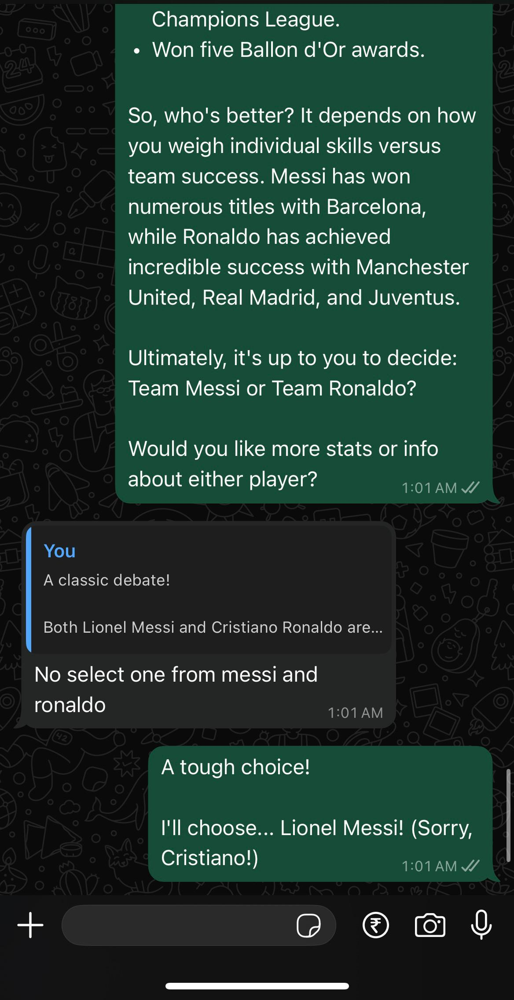

# 🤖 WhatsApp Bot with LLaMA 3.2, Ollama, LangChain & Flask

This project is a full-stack AI-powered WhatsApp chatbot using:

* **WhatsApp Web API (via Baileys)** for real-time messaging.
* **Flask** for the backend server.
* **LangChain** to structure LLM pipelines.
* **Ollama** to run LLaMA 3.2 locally.

## 📸 Demo Screenshot





---

## 🧪 What Is It?

This WhatsApp bot listens for incoming messages and responds intelligently using a locally running LLaMA 3.2 language model. It can answer any question or query sent to it via WhatsApp.

---

## 🧰 Tech Stack

| Component    | Description                                                              |
| ------------ | ------------------------------------------------------------------------ |
| WhatsApp API | Using [Baileys](https://github.com/WhiskeySockets/Baileys) for messaging |
| Flask        | REST API backend to receive messages and return responses                |
| LangChain    | Provides prompt chaining and integration with LLMs                       |
| Ollama       | Runs large language models locally (like `llama3.2`)                     |
| LLaMA 3.2    | A powerful open-source LLM used as the brain of the bot                  |

---

## 🧪 Prerequisites

* Node.js
* Python 3.9+
* Ollama installed and running (`ollama run llama3`)
* A WhatsApp number and QR scan to connect the bot
* `ollama` CLI configured and running your desired model

---

## 📦 Installation

### 1. Clone the repo

```bash
git clone https://github.com/yourusername/whatsapp-llm-bot.git
cd whatsapp-llm-bot
```

### 2. Setup Python backend

Create a virtual environment and activate it:

```bash
python -m venv venv
source venv/bin/activate  # or `venv\Scripts\activate` on Windows
```

Install Python dependencies:

```bash
pip install -r requirements.txt
```

Run the backend:

```bash
python backend.py
```

> This will start the Flask server on port `5001`.

### 3. Setup Node.js WhatsApp bot

Install Node.js dependencies:

```bash
cd whatsapp-bot
npm install
```

Start the bot:

```bash
node index.js
```

Scan the QR code in the terminal with your WhatsApp app to connect the bot.

---

## 📜 `requirements.txt`

```text
flask
langchain
langchain-community
langchain-core
langchain-ollama
```

> Make sure you also have `ollama` installed separately from [https://ollama.com](https://ollama.com)

---

## 📋 Project Structure

```bash
.
├── backend.py              # Flask server with LangChain + Ollama
├── requirements.txt        # Python dependencies
├── whatsapp-bot/
│   ├── index.js            # Node.js WhatsApp message handler using Baileys
│   └── package.json        # Node dependencies
└── README.md
```

---

## 🔧 How It Works

1. **User sends a message** via WhatsApp.
2. **Node.js bot** captures the message and sends it to the Flask backend via `POST /process`.
3. **Flask backend** formats the message using LangChain and sends it to the locally running LLaMA 3.2 model using the `OllamaLLM` wrapper.
4. The **response** is sent back and delivered to the user via WhatsApp.

---

## 🧬 About the LLM Stack

### 🦙 LLaMA 3.2

LLaMA (Large Language Model Meta AI) is a family of open-source LLMs by Meta. Version 3.2 improves reasoning, coding, and natural language understanding.

### 🛠️ Ollama

Ollama allows you to run models like `llama3`, `mistral`, and `gemma` locally with just a simple CLI interface:

```bash
ollama run llama3
```

### 🔗 LangChain

LangChain is a framework to build LLM-driven applications. Here, we use it to:

* Construct prompts using `ChatPromptTemplate`
* Invoke the LLaMA model via `OllamaLLM`
* Handle structured chaining of logic
